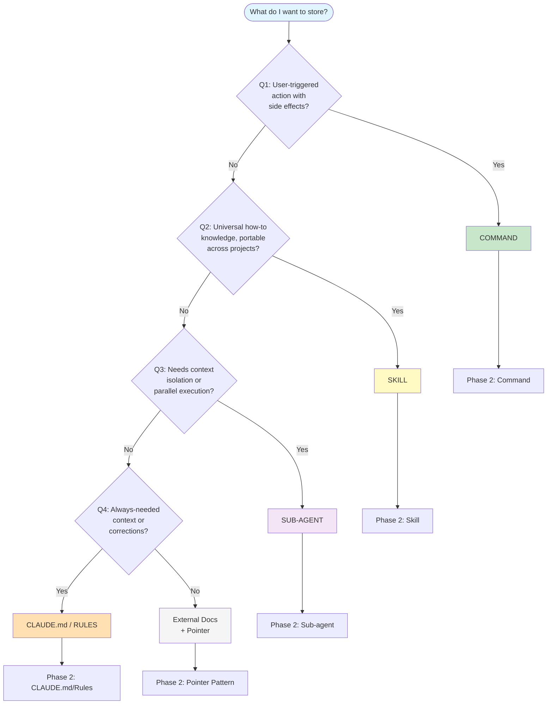

# Section 4: The Two-Phase Decision Guide

This is the **practical heart** of TrigMem—where theory meets action. The two-phase approach lets you
make quick, reliable decisions—most common cases can be resolved in under 30 seconds. If you
understand the theory (Section 1) and categories (Section 2), this guide shows you how to apply them.

---

## How This Guide Works

**Phase 1: Triage** — Answer 4 quick questions to identify your destination.
**Phase 2: Refinement** — Apply destination-specific guidance to finalize placement.

> **Note for AI Agents**: This two-phase approach is designed for human learning. If you're an AI
> reading this, you can often decide directly by analyzing the content against the 6 information
> categories (Section 2) and the mechanism characteristics (Section 3). The phased approach helps
> humans build intuition.

---

## Phase 1: The Triage Questions

Answer these questions in order. Stop at the first "Yes."

```
┌─────────────────────────────────────────────────────────────────────────────┐
│                           PHASE 1: TRIAGE                                   │
├─────────────────────────────────────────────────────────────────────────────┤
│                                                                             │
│  Q1: Is this a USER-TRIGGERED ACTION with side effects?                    │
│      (build, deploy, generate, run tests)                                   │
│      YES → COMMAND                                                          │
│                                                                             │
│  Q2: Is this UNIVERSAL HOW-TO knowledge portable across projects?           │
│      (patterns, methodologies, procedures)                                  │
│      YES → SKILL                                                            │
│                                                                             │
│  Q3: Does this need CONTEXT ISOLATION or parallel execution?                │
│      (large refactoring, independent workstreams)                           │
│      YES → SUB-AGENT                                                        │
│                                                                             │
│  Q4: Is this ALWAYS-NEEDED project context or corrections?                  │
│      (identity, structure, rules, fixes)                                    │
│      YES → CLAUDE.md / RULES                                                │
│                                                                             │
└─────────────────────────────────────────────────────────────────────────────┘
```

### Q1: Is this a user-triggered action with side effects?

**Examples that say YES:**
- "Deploy to staging"
- "Run the full test suite"
- "Generate a new component from template"
- "Create a PR with our format"

**Examples that say NO:**
- "How to deploy" (that's knowledge, not an action)
- "We use Jest for testing" (that's identity)

**→ YES: Go to Phase 2 → Command**

---

### Q2: Is this universal how-to knowledge portable across projects?

**Examples that say YES:**
- "How to implement Hexagonal Architecture"
- "How to write a React custom hook"
- "TDD workflow: red-green-refactor"
- "Code review best practices"

**Examples that say NO:**
- "In this project, domain goes in `src/domain/`" (that's project-specific)
- "Run tests with `pnpm test`" (that's a command)

**→ YES: Go to Phase 2 → Skill**

---

### Q3: Does this need context isolation or parallel execution?

**Examples that say YES:**
- "Refactor all API handlers to new pattern"
- "Fix these 5 independent bugs"
- "Experiment with a new approach without polluting context"
- "Large task with many planning/coding/testing steps"

**Examples that say NO:**
- "Fix this one bug" (simple task, no isolation needed)
- "How to refactor" (that's knowledge for a skill)

**→ YES: Go to Phase 2 → Sub-agent**

---

### Q4: Is this always-needed project context or corrections?

If you've reached this question, your content is likely:
- Project identity (what is this project?)
- Codebase Structure (where is everything?)
- Architectural guidance (how we do things here)
- Iterative corrections (don't make that mistake again)

**→ YES: Go to Phase 2 → CLAUDE.md / Rules**

---

## Visual Decision Flowchart



---

## Phase 2: Refinement

Once you've identified the destination, use these refinement guidelines.

> **Phase 2 Is Iterative—Like Refactoring**
>
> You don't need to get placement perfect on the first try. Phase 2 is like refactoring code:
> start with a reasonable placement, then adjust as you learn what works.
>
> - **It's OK to move things later**: A skill that starts in CLAUDE.md can move to Rules
> - **Consider trade-offs over time**: Token economy vs. precision vs. convenience
> - **Watch for signals**: If Claude ignores a rule, maybe it's in the wrong place
> - **Stuck between two destinations?** Use the [Mechanism × Dimension Matrix](01-theory.md#the-mechanism--dimension-matrix) to compare trade-offs
>
> The goal is a *working* system, not a perfect one. Iterate based on real usage.

---

### Phase 2 → Command

You've determined this is a user-triggered action. Now refine:

#### Is it a simple, single action?
Create a straightforward command file.

```
.claude/commands/deploy-staging.md
```

```markdown
# Deploy to Staging

Deploy the current branch to the staging environment.

## Steps
1. Run tests: `pnpm test`
2. Build: `pnpm build`
3. Deploy: `./scripts/deploy-staging.sh`
4. Verify: `curl https://staging.example.com/health`
```

#### Does it need arguments?
Use the `argument-hint` frontmatter.

```yaml
---
argument-hint: "[environment]"
---
```

#### Should Claude NEVER auto-invoke this?
Commands are user-only by default—Claude cannot auto-invoke them. This is the right choice for
actions with significant side effects.

**Micro-examples:**
- "Deploy to production" → Command (explicit user action, significant side effects)
- "Extract the deployment steps into a reusable skill" → If the how-to knowledge is universal, refactor it from a Command into a Skill

*See [Worked Examples](examples/worked-examples.md) for complete walkthroughs.*

---

### Phase 2 → Skill

You've determined this is reusable knowledge. Now refine:

#### Is it truly portable?
Check: Could this skill work in ANY project using the same technology?

**Good (portable):**
```markdown
# Hexagonal Architecture

Hexagonal Architecture separates business logic from infrastructure...
```

**Bad (has hardcoded paths):**
```markdown
# Hexagonal Architecture

Put domain logic in `src/domain/` and infrastructure in `src/infra/`...
```

If you have project-specific paths, extract them to Rules or CLAUDE.md.

#### Should Claude auto-invoke it?
By default, skills can be invoked by both user (`/skill-name`) and Claude (when relevant).

| Control | Frontmatter |
|---------|-------------|
| Default (both can invoke) | *(none needed)* |
| User-only | `disable-model-invocation: true` |
| Claude-only (background knowledge) | `user-invocable: false` |

#### Is it configurable?
If the skill needs project-specific values, consider the configurable skill pattern
(see [Section 7 - Configurable Skills](07-configurable-skills.md)).

**Micro-example:** "How to implement repository pattern" → Skill (universal how-to knowledge)

*See [Worked Examples](examples/worked-examples.md) for complete walkthroughs.*

---

### Phase 2 → Sub-agent

You've determined this needs isolation. Now refine:

#### Why do you need isolation?

| Reason | Use Case |
|--------|----------|
| **Parallel work** | Multiple specialist sub-agents (frontend dev, backend dev, code reviewer) |
| **Complex multi-step** | Large refactoring with plan → implement → test cycle |
| **Experimentation** | Try an approach without polluting main context |
| **Clean handoff** | Get focused results back to main conversation |

#### Does the agent need special context?
Agents can be configured with specific skills, tools, or instructions.

```markdown
# Refactoring Agent

You are a refactoring specialist. Use the `hexagonal-architecture` skill
when restructuring code.

## Your Task
Refactor the authentication module to follow Hexagonal Architecture.

## Constraints
- Don't modify the API contracts
- Maintain all existing tests
```

#### Should it reference skills?
Agents should **reference** skills for patterns rather than duplicating knowledge.
This keeps agents lightweight and focused on execution.


**Micro-examples:**
- "Refactor all API handlers" → Sub-agent (large task, benefits from isolation)
- "Spawn a frontend specialist and backend specialist in parallel" → Sub-agents (domain-specific experts)
- "Run a code reviewer agent alongside a documentation agent" → Sub-agents (independent workstreams)

*See [Worked Examples](examples/worked-examples.md) for complete walkthroughs.*


> **⚠️ Sub-agents don't inherit CLAUDE.md, skills, or rules.** Use `skills:` frontmatter for custom agents, or pass content in the prompt for ad-hoc spawns. See [Section 3 — Sub-agent Context Isolation](03-storage-options.md#5-sub-agents) for details.
---

### Phase 2 → CLAUDE.md / Rules

You've determined this is always-needed context. Now refine:

#### Is it project identity or structure?
→ **CLAUDE.md**

```markdown
# Project: ShopFlow
B2B e-commerce platform for wholesale distributors.

## Stack
Next.js 14, TypeScript, Prisma, PostgreSQL

## Structure
- `src/app/` - Next.js app router pages
- `src/components/` - React components
- `src/lib/` - Shared utilities
```

#### Is it tied to specific file patterns?
→ **Rules**

```yaml
# .claude/rules/typescript.md
---
globs: ["*.ts", "*.tsx"]
---

# TypeScript Conventions

- Use `unknown` instead of `any`
- Prefer interfaces over types for object shapes
- Always specify return types for functions
```

#### Is it a correction for repeated mistakes?
→ **Rules** (targeted) or **CLAUDE.md** (if critical and universal)

```yaml
# .claude/rules/prisma.md
---
globs: ["prisma/**", "*.prisma"]
---

# Prisma Rules

- Never INSERT directly to `user` table - use `create_user()` function
- Always include `deleted_at IS NULL` in queries
```

#### Is it too long for CLAUDE.md?
Use the **pointer pattern**: keep brief reference in CLAUDE.md, full content in external docs.

```markdown
# In CLAUDE.md
See `docs/architecture.md` for full architecture documentation.
```

**Micro-example:** "We use PostgreSQL with Prisma" → CLAUDE.md (project identity, always needed)

*See [Worked Examples](examples/worked-examples.md) for complete walkthroughs.*

---

### Phase 2 → Pointer Pattern (External Docs)

**Recall Q4:** *"Is this always-needed project context or corrections?"* (identity, structure, rules, fixes)

If you answered "No" to Q4, your content might be:
- Detailed documentation that's too long for CLAUDE.md
- Reference material not needed in every conversation
- Historical context or explanations

#### Use the pointer pattern:

1. **Store full content** in `docs/` folder
2. **Add brief pointer** in CLAUDE.md or relevant skill

```markdown
# In CLAUDE.md
## Documentation
- Architecture: `docs/architecture.md`
- Testing philosophy: `docs/testing.md`
- API reference: `docs/api.md`
```

Claude will read these files when relevant, but they won't consume tokens in every message.

---

## Quick Decision Reference

| If your content is... | Then use... | Because... |
|-----------------------|-------------|------------|
| A workflow/action users trigger | **Command** | Explicit control, side effects |
| Universal how-to knowledge | **Skill** | Reusable, on-demand, portable |
| Large/complex isolated task | **Sub-agent** | Context isolation, parallelization |
| Project identity/structure | **CLAUDE.md** | Always needed, minimal tokens |
| File-type conventions | **Rules** | Pattern-triggered, contextual |
| Mistake corrections | **Rules** | Automatic enforcement |
| Long reference docs | **External + Pointer** | Token economy |

---

## Common Patterns

Phase 2 sometimes reveals that a single piece of knowledge spans multiple categories.
When that happens, **decompose it across mechanisms** — each part goes where it fits best.

### Pattern: "We use X technology"
- **Identity statement** (e.g., "We use PostgreSQL") → CLAUDE.md
- **How to use it** (e.g., "How to write Prisma queries") → Skill
- **Our conventions** (e.g., "Always use soft deletes") → Rules

### Pattern: "Run/Build/Deploy something"
- **The action itself** → Command
- **How the process works** (if teaching) → Skill
- **Prerequisites** (e.g., "Requires Docker running") → CLAUDE.md

### Pattern: "Follow this coding standard"
- **Universal standard** (e.g., "SOLID principles") → Skill
- **Our specific rules** (e.g., "Use kebab-case for files") → Rules
- **Why we do it** (if long explanation) → External docs + pointer

### Pattern: "Enforce an architectural standard"
- **The pattern itself** (e.g., "Repository Pattern principles") → Skill
- **Our conventions** (e.g., "Repos live in `src/repos/`, use Prisma") → Rule
- **An agent that applies it** (e.g., "Refactor all data access to use repos") → Sub-agent referencing the Skill

---

## Summary

**Phase 1 Triage** gets you to the right destination:
1. User-triggered action? → Command
2. Universal how-to? → Skill
3. Needs isolation? → Sub-agent
4. Always-needed context? → CLAUDE.md / Rules

**Phase 2 Refinement** helps you finalize:
- Commands: Simple vs. complex, arguments, user-only (default)
- Skills: Portable check, invocation control, configurable pattern
- Sub-agents: Isolation reason, context needs, skill references
- CLAUDE.md/Rules: Identity vs. patterns, file triggers, pointer pattern

For most decisions, Phase 1 is enough. Phase 2 handles the nuances.

---

*Previous: [Section 3 - The Storage Options](03-storage-options.md)*
*Next: [Section 5 - CLAUDE.md Best Practices](05-claudemd-best-practices.md)*
